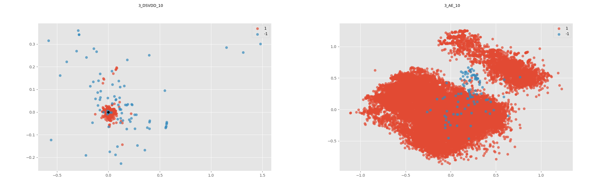

# PyTorch Implementation of Deep SVDD
Je me suis appuyé sur le reposirtory https://github.com/lukasruff/Deep-SVDD-PyTorch qui a fait une implémentation en torch de l'algo DeepSVDD. J'ai adapté l'algo pour les données bancaires.

Dans le cas de l'auto_encodeur le score d'anomalie est l'erreur de reconstruction. Pour le DeepSVDD, il s'agira de la distance par rapport au centre.

## Expériences menées 
 * Autoencodeur avec comme dimension de l'espace latent dans [2, 3, 5, 10, 20] : globalement c'est le modèle le plus stable/performant de cette famille et l'auc moyen augmente en fonction de la dimension. En terme de auc precision_recall l'autoencodeur est meilleur que IForest et OneClass pour ce data.
 * Deep SVDD avec les deux configurations évoquées dans l'article : La variabilité des performances d'une exécution à l'autre est énorme. Je suis encore entrain d'investiguer sur les raisons derrière cette grande variabilité
 * J'ai aussi évalué les résultats des modèles OneClassSVM et IForest sur les données encodées : Là encore la variabilité n'est pas faible
## PCA
<p align="center">
  
</p>


## Citation

```
@InProceedings{pmlr-v80-ruff18a,
  title     = {Deep One-Class Classification},
  author    = {Ruff, Lukas and Vandermeulen, Robert A. and G{\"o}rnitz, Nico and Deecke, Lucas and Siddiqui, Shoaib A. and Binder, Alexander and M{\"u}ller, Emmanuel and Kloft, Marius},
  booktitle = {Proceedings of the 35th International Conference on Machine Learning},
  pages     = {4393--4402},
  year      = {2018},
  volume    = {80},
}
```
