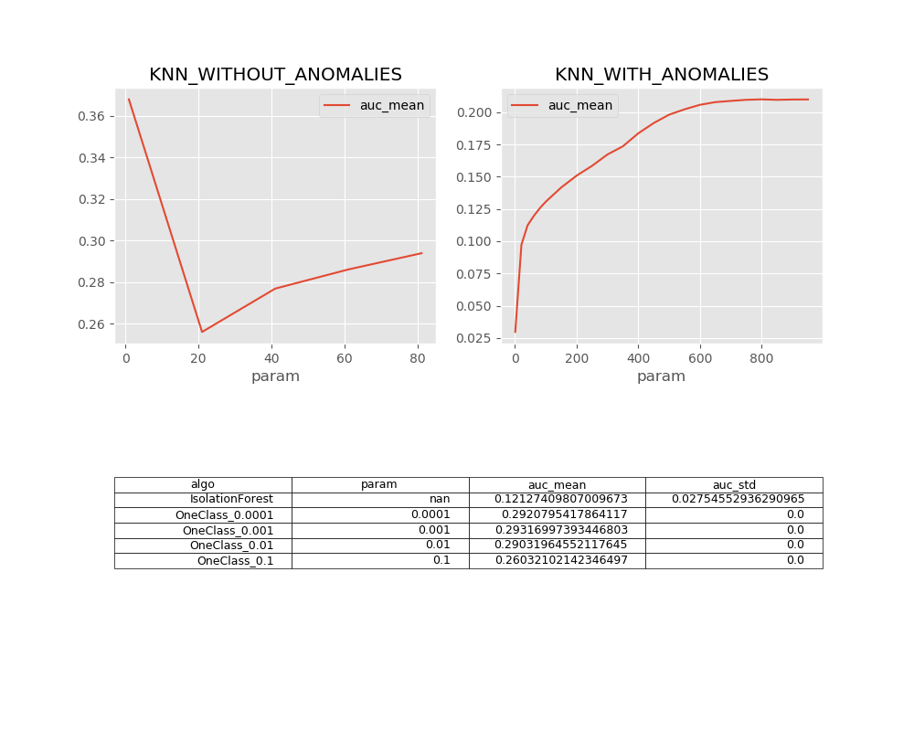
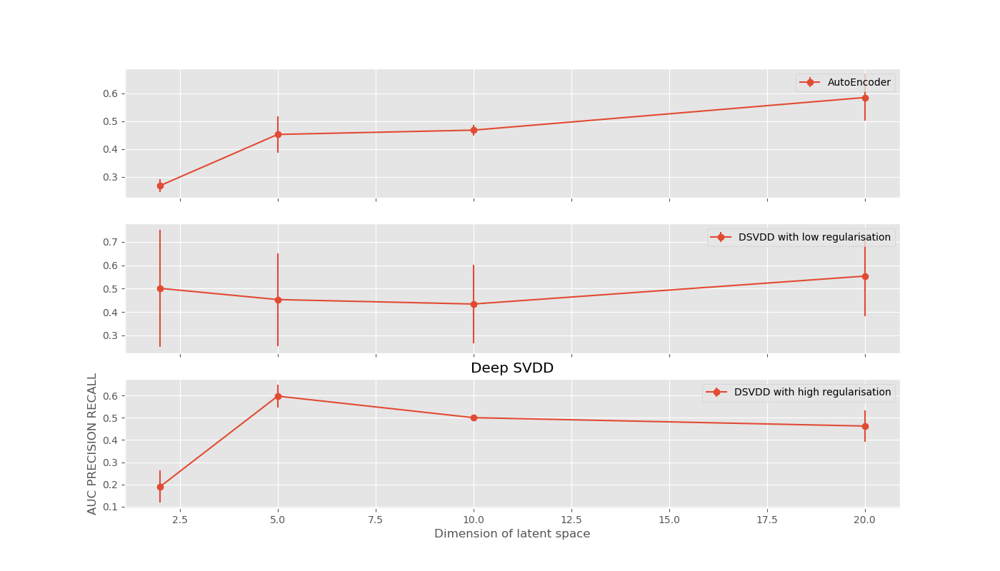
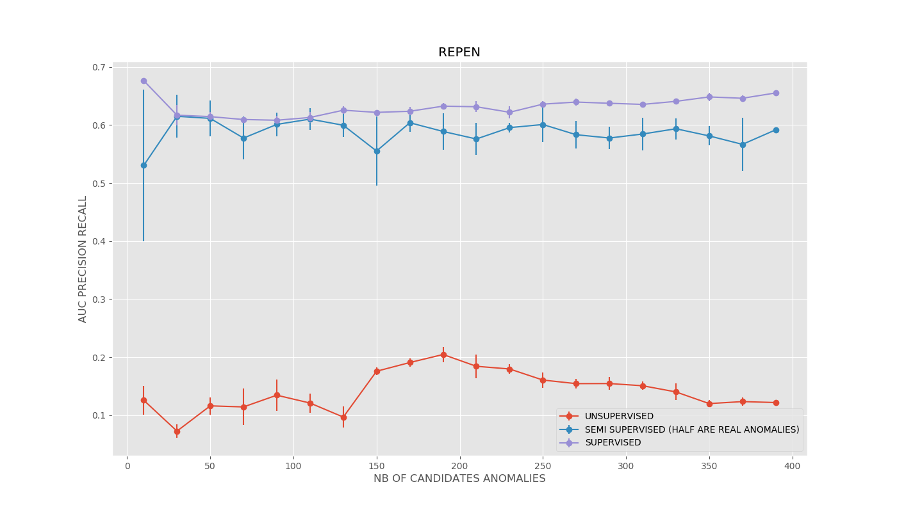
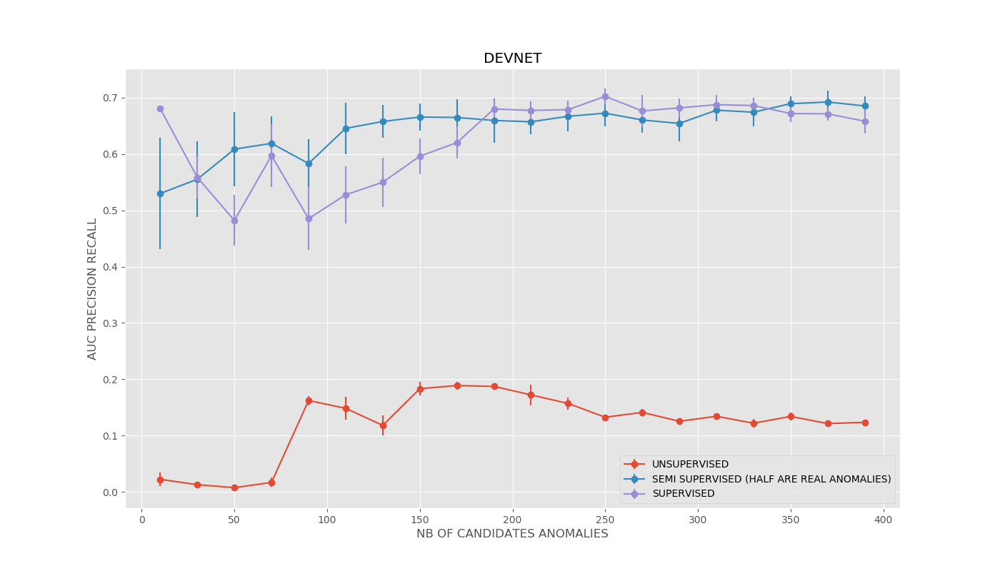

# Anomaly_detection
Application de quelques modèles de détection d'anomalies sur des données bancaires

## Dataset
Le dataset contient des informations sur des transactions bancaires et est accéssible sur kaggle : https://www.kaggle.com/mlg-ulb/creditcardfraud.
Il est composé de 492 fraudes sur un total de 284 807 transactions. chaque transaction étant caracterisée par 30 variables

## Modèles testés 
  * Isolation Forest et OneClassSVM se trouvant le dossier Iso_Oneclass
  * Auto Encodeur et Deep Support Vector Data Description se trouvant dans le dossier deep_svdd  
  * REPEN
  * Deep Anomaly Detection with Deviation Network

## Structure des répertoires 
Pour chacun des modèles j'ai testé plusieurs combinaisons d'hyperparamètres (dimension de l'espace latent etc.) et je stockais à chaque fois les AUC precision-recall.
Les repertoires associés aux modèles contiennent des scripts.py, un dossier images contenant des plots de courbe Precision-Recall et des PCA des representations apprises, un dossier results stockant les valeurs des auc moyennes ainsi que les écarts types associés (J'ai exécuté plusieurs fois les algos afin d'évaluer leur stabilité)

## Résultats Généraux

### ML algorithms 

  

* KNN est globalement plus performants que les autres approches, vient ensuite le OneClassSVM. Par ailleurs il est important de noter que'entraîner le KNN en gardant des anomalies dans les données d'entraînement dégrade considérablement les performances.
* KNN et OneClass prennent du temps.

### AutoEncoder & DeepSVDD

  

* Deep_SVDD bien regularisé fournit des performances supérieures à l'auto_encodeur et celles ci croissent en fonction de la dimension de l'espace latent.
* Attention à l'instabilité et la dégénérescence de la méthode D_SVDD

### REPEN

  

* Modèle stable ne dépendant pas beaucoup de la quantité d'anomalies qu'on lui donne en semi-supervisé. Par contre il est bien moins performant en non supervisé

### Deviation Network

  

* La contamination influence beaucoup sur la stabilité et les performances du modèle. Il semble mieux fonctionner avec très peu ou beaucoup d'anomalies dans la configuration semi-supervisé

## Liens vers les articles
  * Deep SVDD : http://proceedings.mlr.press/v80/ruff18a/ruff18a.pdf
  * REPEN : https://arxiv.org/pdf/1806.04808.pdf
  * Deep Anomaly Detection : https://arxiv.org/pdf/1911.08623.pdf
  * LeSiNN : https://www.researchgate.net/publication/304298483_LeSiNN_Detecting_Anomalies_by_Identifying_Least_Similar_Nearest_Neighbours
